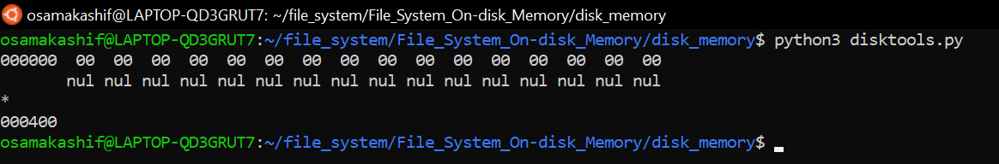
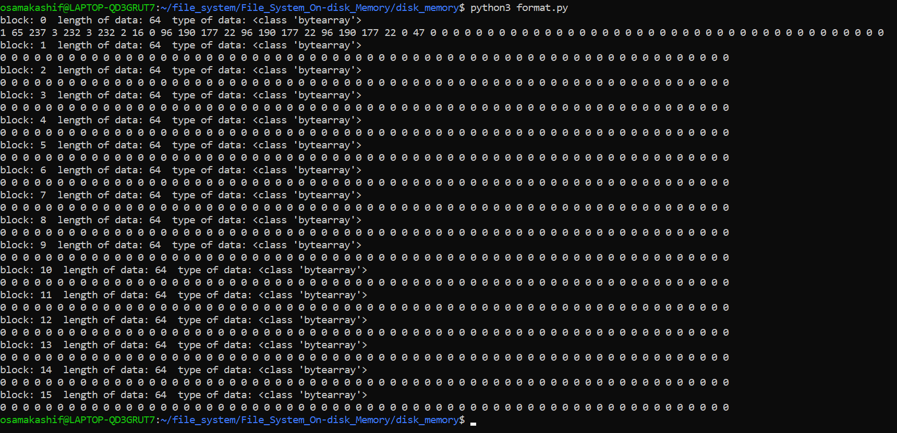
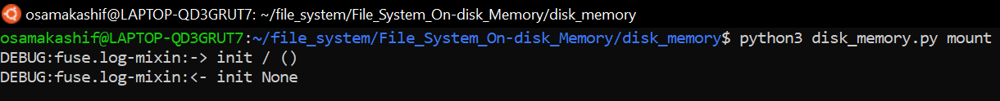
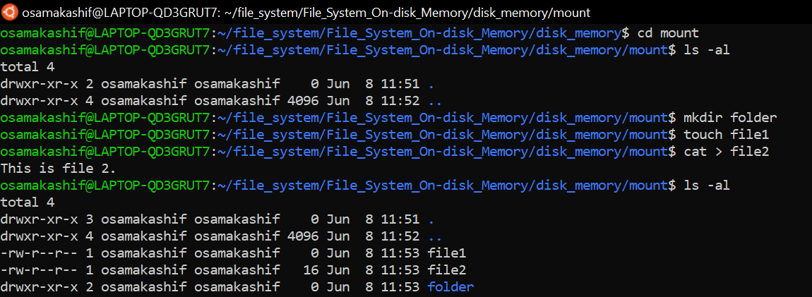
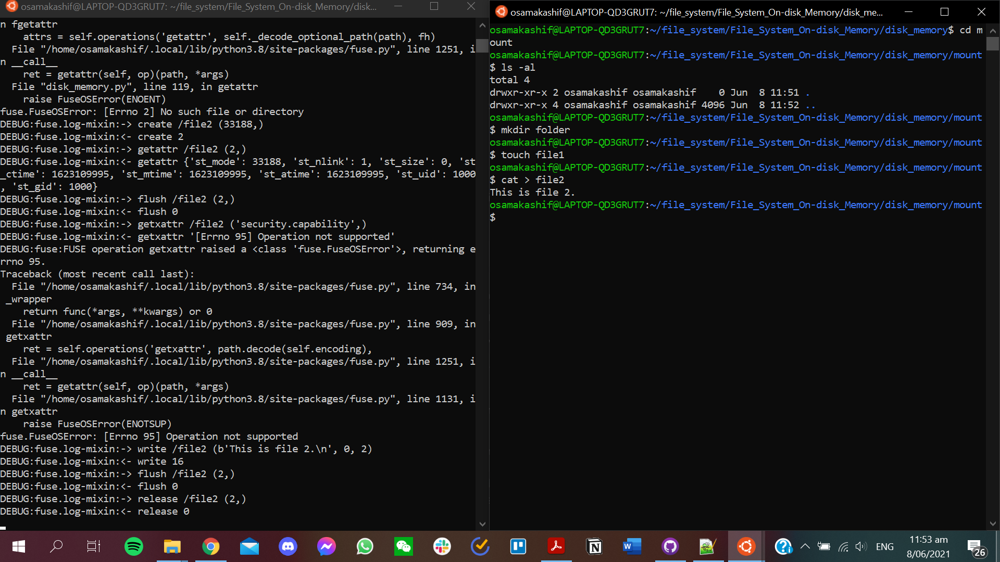
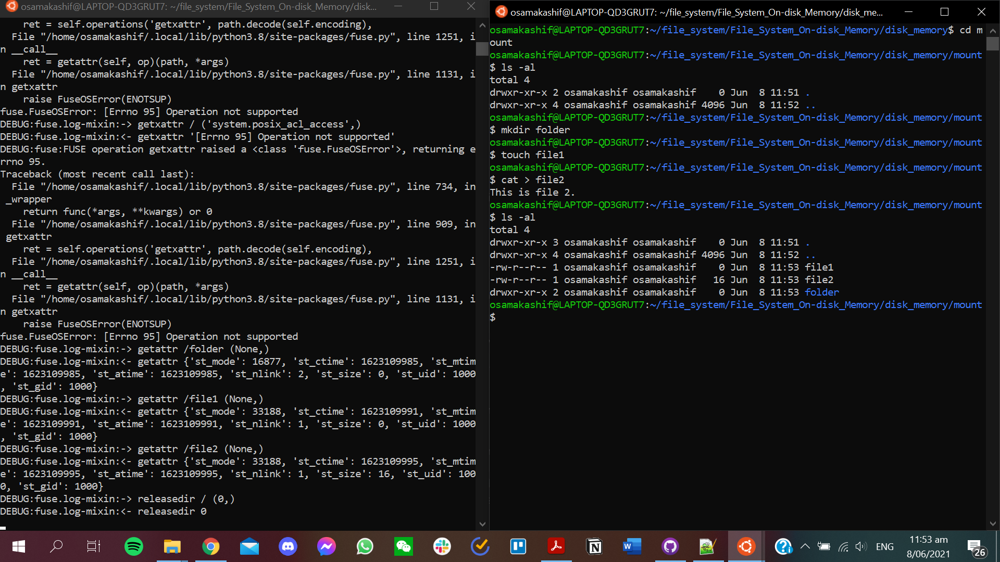
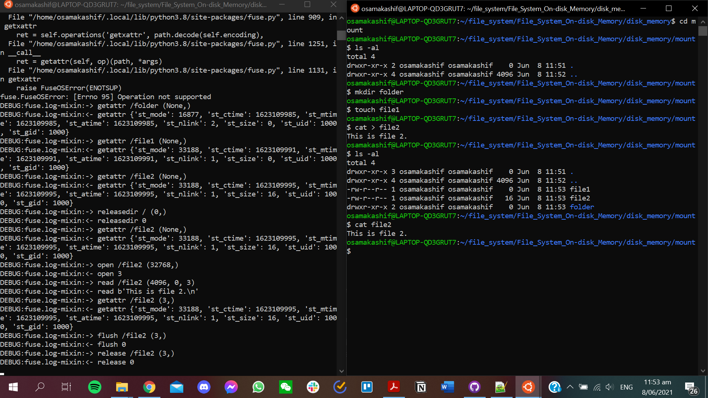

# File_System_On-disk_Memory
A file system made based on memory.py, but stores on disk rather than working on just memory. Based off of a university assignment, 'disktools.py' provided with that.

## About the file system

The file system was built on a Linux distribution, specificially Ubunutu 20.04 LTS running on WSL 2.
It was run and tested using python3.
Current version only has directories working at the root level.

## How to run (commands on Linux command line):

First clone the repositiory.
Then within the 'disk_memory' folder run the following commands (varying on whether you have python or python3 installed):
1) `python disktools.py` or `python3 disktools.py`
This creates 'my-disk' which creates blocks of data for storage.
2) `python format.py` or `python3 disktools.py`
Formats 'my-disk' for storage. 16 blocks of 64 bytes which are empty except for block 0 which has the root now.
3) `mkdir mount`
This makes the 'mount' directory for the filesystem to mount onto, can be named something else other than 'mount'.

Now, you can run 'disk_memory.py' on 'mount'.
To run any commands and see the changes to the filesystem you would need to open two windows for the command line.
One runs 'disk_memory.py' and shows any changes while the other is used to run any commands.

Run `python disk_memory.py mount` or `python3 disk_memory.py mount` and use the other command line to run commands on or within 'mount'.

## Screenshots of how running the files looks like

Running 'disktools.py':

Running 'format.py':

Running 'disk_memory.py' on 'mount':

Editing 'mount' (like how you would normally do stuff on the Linux commandline):

Showing the results on the filesystem as 'disk_memory.py' is running on 'mount' and commands are run on/in 'mount':

1)

2)

3)

## Provided files:

disktools.py